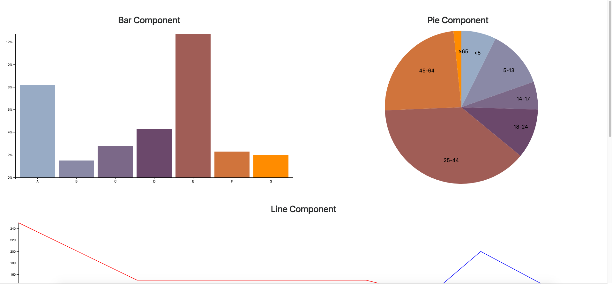
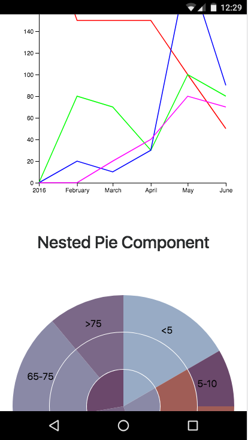

# Angular4-D3

该项目是使用[Angular CLI]（https://github.com/angular/angular-cli)1.2.0生成的。

## Demo url

[Ng4-D3-Component](https://ng4d3components.herokuapp.com/)

## Development server

浏览器打开 `http://localhost:4200/`. 如果修改文件会自动更新.

## Code scaffolding

运行`ng generate component component-name`以生成新组件。 您还可以使用`ng generate directive | pipe | service | class | module`。

## Build

运行`ng build`来构建项目。 构建工件将存储在`dist /`目录中。 使用`-prod`标志进行生产构建。

## Running unit tests

运行`ng test`以通过[Karma]（https://karma-runner.github.io）执行单元测试。

## Running end-to-end tests

运行`ng e2e`以通过[Protractor]（http://www.protractortest.org/）执行端到端测试。
在运行测试之前，请确保通过“ng serve”为应用程序提供服务。

## Further help

要获得Angular CLI的更多帮助，请使用“ng help”或查看[Angular CLI README]（https://github.com/angular/angular-cli/blob/master/README.md）。

## Results

Desktop View | Mobile View
:--:|:--:
 | 
